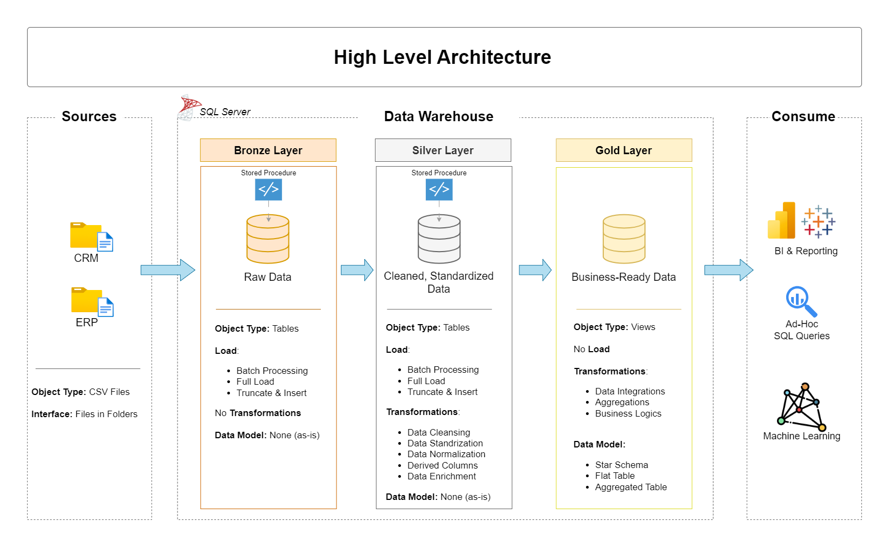

# Data Warehouse and Analytics Project

This is a 2 part project which demonstrates a comprehensive data warehousing (Part 1) and analytics solution (Part 2), from building a data warehouse to generating actionable insights. 


*Image Credit: spauldingridge.com*


# Data Warehouse Project - Part 1 of Data Warehouse and Analytics Project

## Data Architecture

The data architecture for this project follows Medallion Architecture **Bronze**, **Silver**, and **Gold** layers:


1. **Bronze Layer**: Stores raw data as-is from the source systems. Data is ingested from CSV Files into SQL Server Database.
2. **Silver Layer**: This layer includes data cleansing, standardization, and normalization processes to prepare data for analysis.
3. **Gold Layer**: Houses business-ready data modeled into a star schema required for reporting and analytics.

## Project Overview

This project involves:

1. **Data Architecture**: Designing a Modern Data Warehouse Using Medallion Architecture **Bronze**, **Silver**, and **Gold** layers.
2. **ETL Pipelines**: Extracting, transforming, and loading data from source systems into the warehouse.
3. **Data Modeling**: Developing fact and dimension tables optimized for analytical queries.

## Project Phases - Epics and Tasks

**[Notion Project Steps](https://www.notion.so/SQL-Data-Warehouse-Project-1c13f4db0b7e80b9adcaf107b9417f41?pvs=4):** Project Phases on Notion.

## Project Requirements

### Building the Data Warehouse (Data Engineering)

#### Objective
Develop a modern data warehouse using SQL Server to consolidate sales data, enabling analytical reporting and informed decision-making.

#### Specifications
- **Data Sources**: Import data from two source systems (ERP and CRM) provided as CSV files.
- **Data Quality**: Cleanse and resolve data quality issues prior to analysis.
- **Integration**: Combine both sources into a single, user-friendly data model designed for analytical queries.
- **Scope**: Focus on the latest dataset only; historization of data is not required.
- **Documentation**: Provide clear documentation of the data model to support both business stakeholders and analytics teams.


## Repository Structure
```
data-warehouse-project/
│
├── datasets/                           # Raw datasets used for the project (ERP and CRM data)
│
├── docs/                               # Project documentation and architecture details
│   ├── data_architecture.png           # Diagram showing project's architecture
│   ├── data_flow.png                   # Diagram showing data flow 
│   ├── data_models.png                 # Diagram showing data models (star schema)
│   ├── data_catalog.md                 # Catalog of datasets, including field descriptions and metadata
│   └── naming-conventions.md           # Consistent naming guidelines for tables, columns, and files
│
├── scripts/                            # SQL scripts for ETL and transformations
│   ├── bronze/                         # Scripts for extracting and loading raw data
│   ├── silver/                         # Scripts for cleaning and transforming data
│   └── gold/                           # Scripts for creating analytical models
│
├── tests/                              # Test scripts and quality files
│
└── README.md                           # Project overview and instructions
```

## Source of Inspiration

This project draws ideas, datasets or code structures from the project featured on Youtube channel - Data with Baraa.
